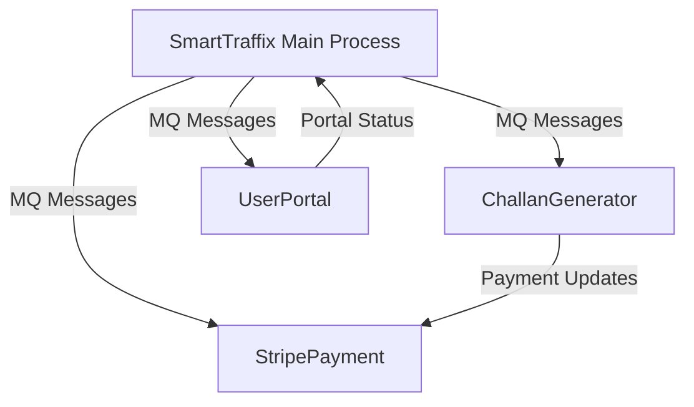

# Traffic-System-OS-

# SmartTraffix - Traffic Management System

 *Example simulation visualization*

## 📝 Overview

SmartTraffix is an advanced traffic management simulation system that demonstrates core operating system concepts through a realistic traffic intersection model. This C++ project implements:

- 🚦 **Process synchronization** with semaphores and mutexes
- ⚠️ **Deadlock prevention** using Banker's Algorithm
- 📨 **Inter-process communication** via POSIX message queues
- 🚗 **Resource management** for vehicle control
- 🧵 **Multithreading** for concurrent operations

## ✨ Key Features

| Feature | Description |
|---------|-------------|
| **Real-time Traffic Simulation** | Dynamic vehicle spawning with different types (Light, Heavy, Emergency) |
| **Intelligent Violation Detection** | Automated speed monitoring and collision detection |
| **Challan Management System** | Ticket generation, payment processing, and user portal |
| **Deadlock Prevention** | Banker's Algorithm implementation for safe resource allocation |
| **Visual Analytics Dashboard** | Real-time statistics display within the simulation |

## 🛠️ System Architecture



## 📥 Installation

### Prerequisites

- Linux environment (Tested on Ubuntu 20.04+)
- C++17 compatible compiler
- SFML 2.5+ library

### Build Instructions

1. Install dependencies:
```bash
sudo apt-get install libsfml-dev g++ make
```

2. Clone the repository:
```bash
git clone https://github.com/yourusername/SmartTraffix.git
cd SmartTraffix
```

3. Compile the project:
```bash
make
```

4. Run the simulation:
```bash
./bin/smarttraffix
```

## 🖼️ Asset Requirements

Place these files in the project root:

| File | Purpose |
|------|---------|
| `assets/road.jpg` | Intersection background |
| `assets/car1.png` | Light vehicle texture |
| `assets/car2.png` | Heavy vehicle texture |
| `assets/emergency.png` | Emergency vehicle texture |
| `assets/DejaVuSans.ttf` | Analytics display font |

## 🎮 Usage

```bash
./bin/smarttraffix [OPTIONS]

Options:
  --no-gui       Run in headless mode (for testing)
  --debug        Enable debug logging
  --scale=FACTOR Window scale factor (default: 1.0)
```

### Key Controls

- `ESC` or close window to exit
- `P` to pause simulation
- `R` to reset analytics

## 📊 Technical Specifications

| Component | Technology Used |
|-----------|-----------------|
| Language | C++17 |
| Graphics | SFML 2.5.1 |
| IPC | POSIX Message Queues |
| Threading | pthread |
| Synchronization | Semaphores, Mutexes |

## 📚 Documentation

- [Design Document](/docs/DESIGN.md)
- [API Reference](/docs/API.md)
- [Banker's Algorithm Implementation](/docs/BANKERS.md)

## 🤝 Contributing

1. Fork the repository
2. Create your feature branch (`git checkout -b feature/AmazingFeature`)
3. Commit your changes (`git commit -m 'Add some amazing feature'`)
4. Push to the branch (`git push origin feature/AmazingFeature`)
5. Open a Pull Request

---

🛑 **Note**: This project requires Linux with POSIX support. Windows users should use WSL or a virtual machine.
